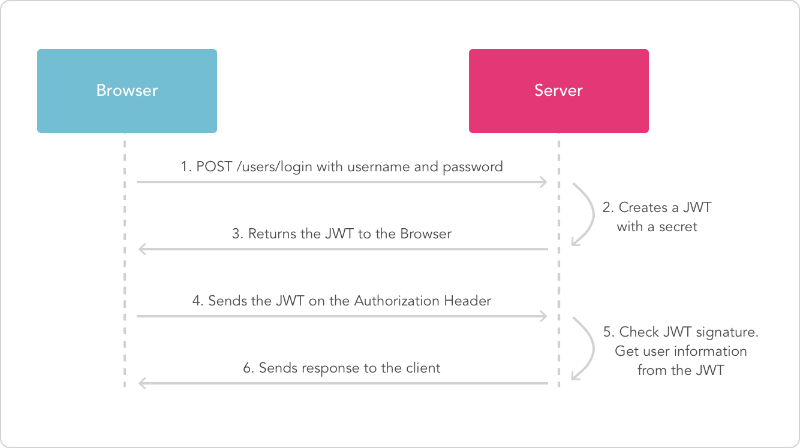

# Introdução à autorização com JSON Web Tokens

Como já comentamos antes, uma API backend expõe dados de forma coordenada e segura. Isto significa que expõe-se apenas o que pode e deve ser exposto e com o cuidado de garantir que apenas usuários autorizados terão acesso aos dados de forma segura.

Neste módulo estudaremos sobre autenticação e autorização usando JSON Web Tokens ([JWT](https://jwt.io/)). Antes de entrarmos na tecnologia, vamos conversar um pouco sobre o que é autenticação e autorização.

*Autenticação* é o ato de atestar a identidade de um usuário. Quando entramos no nosso app de email e colocamos email e senha estamos passando informações sigilosas que só nós sabemos para atestar nossa identidade. Mas essa parte é só uma parte do processo. Por trás, é gerado um token (no nosso caso, um token JWT) seguro que permite a autorização. 

*Autorização* é o cenário mais comum para o uso do token. Após o login do usuário (autenticação), cada solicitação subsequente incluirá o token, permitindo que o usuário acesse rotas, serviços e recursos permitidos com esse token. Enquanto o token não expirar o usuário pode utilizá-lo sem precisar ficar fazendo login várias vezes. O Logon único é um recurso amplamente usado devido à pequena sobrecarga e à capacidade de ser facilmente usado em diferentes APIs. O token vai no _authorization header_ das requisições HTTP do cliente. Ao ler o token, a API consegue identificar se a rota solicitada pode ou não ser acessada pelo usuário em questão (pois o JWT identifica o usuário que está enviando requisições de forma segura).

## Entendendo o JSON Web Token

O JWT define uma maneira compacta e independente de transmitir informações com segurança entre as partes como um objeto JSON. Essas informações podem ser verificadas e confiáveis porque são assinadas digitalmente. Os JWTs podem ser assinados usando um segredo (com o algoritmo HMAC) ou um par de chaves pública/privada usando RSA ou ECDSA.

Em sua forma compacta, os JSON Web Tokens consistem em três partes separadas por pontos (.), que são:

* Cabeçalho (header)
* Carga útil (payload)
* Assinatura (signatire)

Portanto, um JWT normalmente se parece com uma string como essa string: 
````
xxxxx.yyyyy.zzzzz
````

O **cabeçalho** consiste geralmente de duas informações: o tipo de token (que é JWT), e o algoritmo de assinatura usado (ex. HMAC SHA256 ou RSA). Exemplo:

````
{
  "alg": "HS256",
  "typ": "JWT"
}
````

Esse JSON é codificado para formar a primeira parte do JWT (o xxxxx do exemplo acima.)

A **carga útil** traz as declarações a entidade representada pelo JWT (normalmente, o usuário) e dados adicionais. Existem três tipos de declarações: registradas, públicas e privadas. 

Declarações registradas são um conjunto de declarações predefinidas que não são obrigatórias, mas são recomendadas. Algumas delas são: iss (emissor), exp (tempo de expiração), sub (assunto), aud (público). Declarações públicas podem ser definidas à vontade por aqueles que usam JWTs. Mas, para evitar colisões, deve-se tomar certos cuidados ao definí-las. Finalmente, as declarações privadas são personalizadas, especialmente criadas para compartilhar informações entre as partes que concordam em usá-las e não são declarações registradas ou públicas.

Neste exemplo, a declaração "sub" é registrada, a "name" é pública (podemos ver as chaves das declarações públicas nos [Registros IANA de JWTs](https://www.iana.org/assignments/jwt/jwt.xhtml)) e a "admin" é privada. 

Uma vez definidos os pares chave/valor do payload, o JSON é codificado para compor a segunda parte do JWT (a parte yyyyy do exemplo).

Finalmente, a assinatura. Para criar a parte da assinatura usamos o cabeçalho codigficado, o payload codificado, uma chave segreta, e usar o algoritmo de assinatira espscificado no cabeçalho para assinar essa mensagem. 

Finalmente, a assinatura. Para criar a parte da assinatura usamos o cabeçalho codigficado, o payload codificado, uma chave segreta, e usar o algoritmo de assinatira espscificado no cabeçalho para assinar essa mensagem. To create the signature part you have to take the encoded header, the encoded payload, a secret, e usthe algorithm specified in the header, and sign that.
Se, por exemplo, estivermos usando o algoritmo de assinatura HMAC SHA256 a assinatira será criada como a seguir:

````
HMACSHA256(
  base64UrlEncode(cabeçalho) + "." +
  base64UrlEncode(payload),
  secret)
````

A assinatira garante que a mensagem não foi modificada ao longo do caminho entre o cliente e o servidor. No caso de tokens assinados com uma chave privada, o token também atesta que quem envia a mensagem é quem diz ser. Você pode ler JWTs gerados usando [o JWT debugger](https://jwt.io/).

## Como funciona na prática?

Durante a autenticação do usuário, quando o usuário se loga com sucesso passando suas credenciais, um JSON Web Token será retornado. Quando o usuário deseja acessar uma rota/recurso protegido, o software cliente deve enviar o JWT, tipicamente no Authorization header usando o esquema Bearer. O conteúdo do cabeçalho HTTP deve se parecer como abaixo:

````
Authorization: Bearer <token>
````

Em geral, este é um mecanismo de autorização stateless. Quando uma rota protegida do servidor for acessada, o serviço (o seu backend) vai checar se o token que vem no authorization header é válido, e se for, deve identificar o usuário "por trás" do token e verificar se este usuário tem autorização para acessar o recurso. Pode ser necessário acessar a base de dados para recuperar alguma informação, como por exemplo, se este usuário existe no sistema. 

O diagrama abaioxo mostra como um JWT é obtido e usado para acessar APIs:


