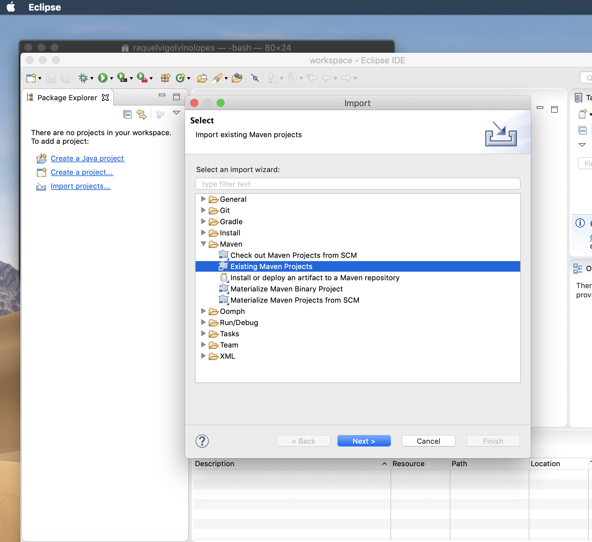

# Criando aplicações Web usando spring boot e eclipse

1. Certifique-se de que tem Java instalado (SDK)
2. Certifique-se de que tem o apache maven instalado (usaremos para gerenciar dependências)
3. Certifique-se de que tem o eclipse (ou outra IDE de sua preferência instalado)

Eu particularmente não acho necessario instalar o pacote spring para o eclipse. A maneira mais fácil (e menos sujeita a erros) de criar um novo projeto de backend Web com spring é usar o starter fornecido pelo spring: [https://start.spring.io/](https://start.spring.io/).

Nesse site vc precisa dar um nome ao pacote do seu projeto, ao projeto em si, escolhar linguagem Java e que o resultado deve estar em um jar. Aí também você já pode escolher algumas dependências para o seu projeto. Como vamos escrever *aplicações REST simples* temos sempre que marcar a opção *Spring Web Starter*. 

Thymeleaf deve ser escolhido caso você vá desenvolver backend que retorna páginas HTML. Não será o foco desta disciplina, aqui vamos desenvolver backend como APIs REST que se comunicam usando HTTP e JSON como representação dos dados.

JPA deve ser uma dependência marcada quando começarmos a trabalhar com bancos de dados.

Uma vez criado o projeto spring, salve em seu disco. Vai surgir um arquivo zip na pasta de downloads default, faça o unzip antes de continuar. 

Vá no eclipse, Import > Maven > existing maven project. A imagem abaixo ilustra esse import.



Vá clicando em next e informando o que é solicitado. Em _root directory_ informe o caminho do diretório do projeto dezipado e deplois clique em Finish/terminar. Pronto, seu projeto spring já está criado.

Siga os passos desde exercício para construir uma API REST bem simples que te oferece uma saudação dependendo da hora do dia.

Para rodar seu projeto abra um terminal, entre no diretório raiz do projeto e execute o comando abaixo:
````
mvn spring-boot:run
````
